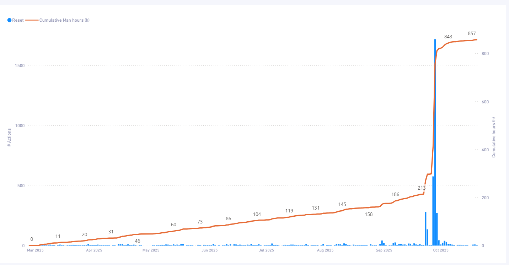
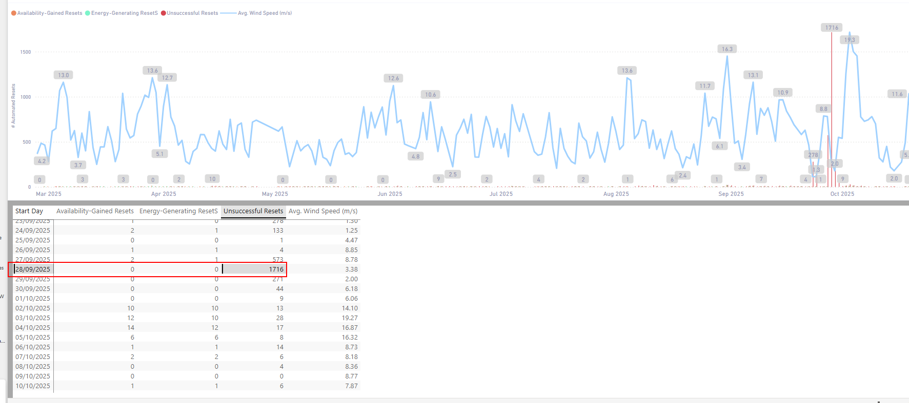
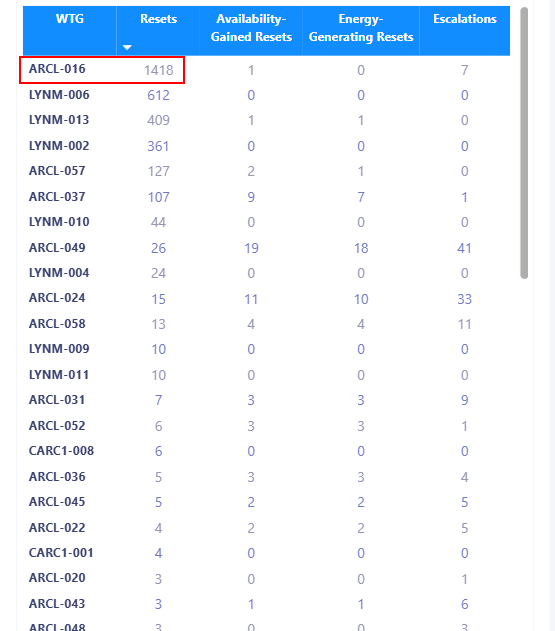
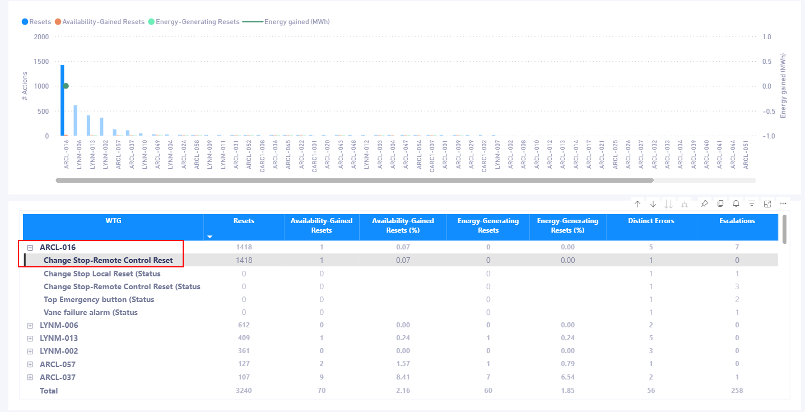
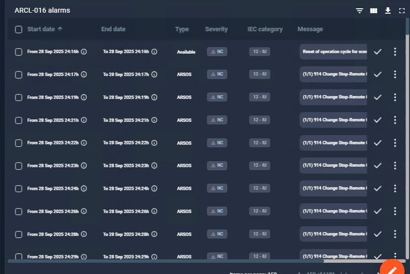

El report de powerBI tiene un problema los cálculos de man hours gained se han desbordado

La causa raiz es la máquina 016 de Areleoch que ha generado muchos eventos de reset

No sé causa raiz del problema y no tengo logs para analizar
Como acción voy a borrar los datos erroneos y repasar el cálculo analítico