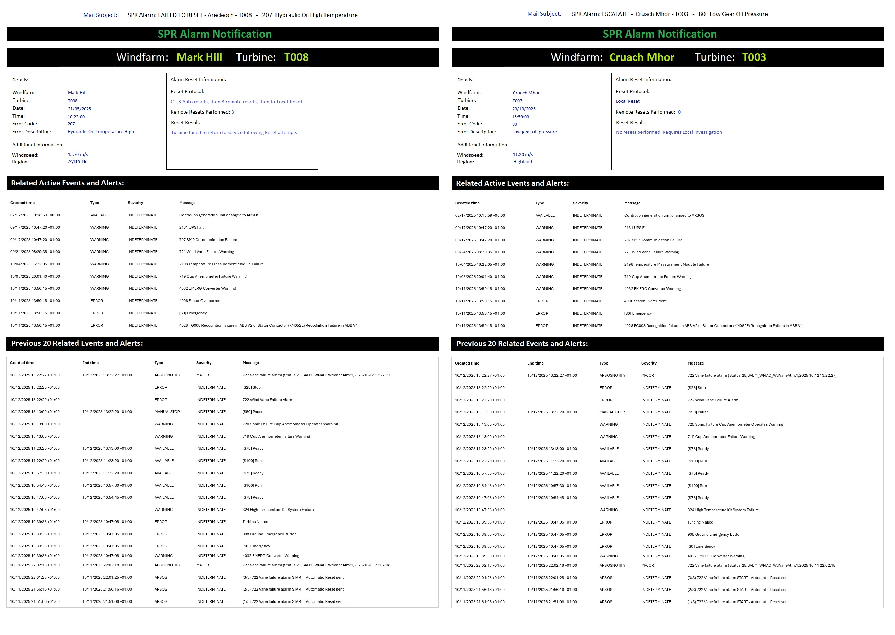

# Allan specs for notification

## Template

 
## SPR Proposal
For every escalation email ARSOS will send, 2 emails:

1. Send email to support teams as per attached (SPR Alarm Notification Template) 

>__Note__: template on Left when a Reset did not recover WT and an escalation is now required. Template on right where no Reset allowed so ARSOS simply emails.

2. Send second email, (with limited required details as below in blue only) that will be used to integrate to RCC OpTrak system using an existing PowerAutomate flow. (Takes info from email and loads to a SharePoint list). 

>__Note__: (Circulation list stay as test circulation for now but finally we will be able to configure using ARSOS FETTool for (1) and (2) will just be to Control Centre Mailbox)

__Note__ above are fields from ARSOS or from FETDatabase

1. Site
2. WT
3. Date of Fault
4. Time of Fault
5. Alarm Description
6. Region
7. OEM
8. ISP

Example:
Subject: TURBINE FAULT ESCALATION Internal T007, Clachan Flats - Inverter Fault
 

1- Clachan Flats 
2- T007 
3- 20/10/2025 
4- 04:45:10 
5- Inverter Fault 
6- Highland 
7- GE 
8- Alstom 

 