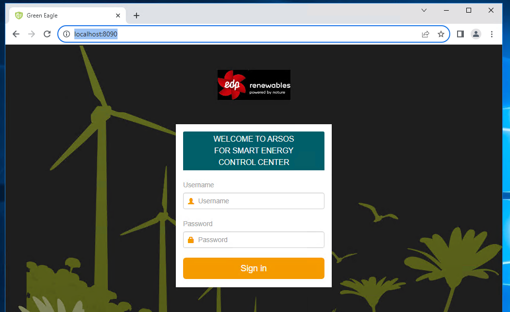
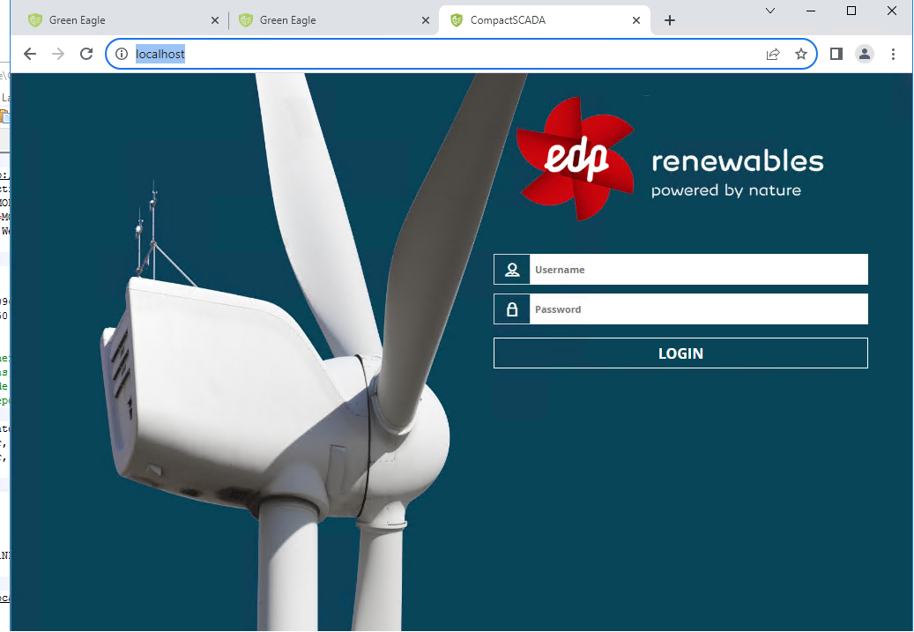
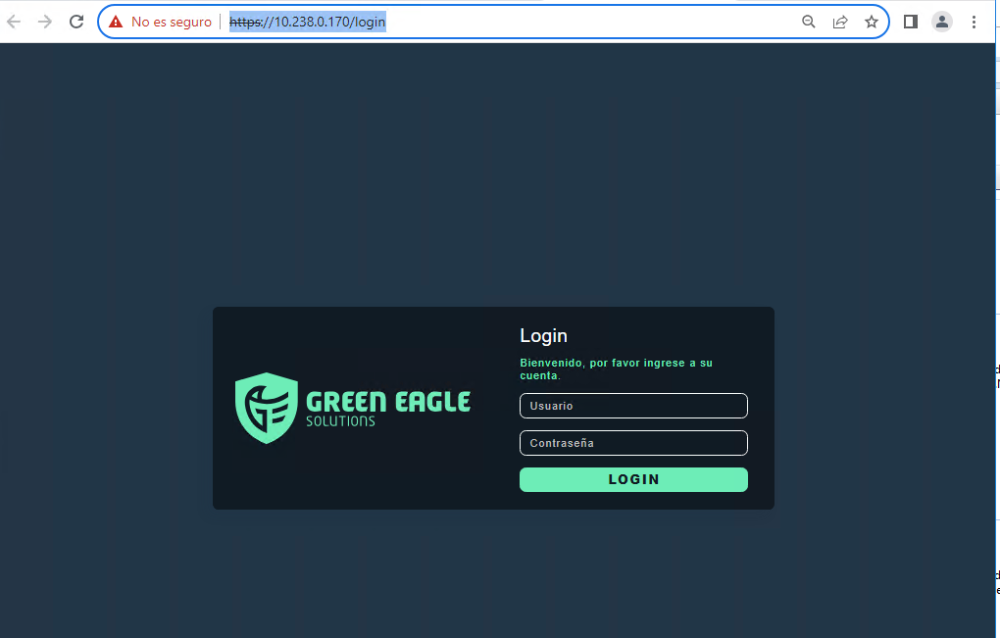
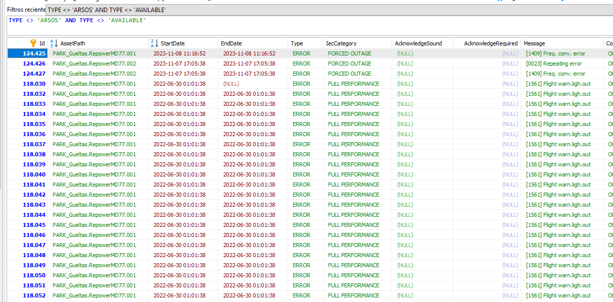

# Gueltas access
Using a win server as gateway connect to Nadara central Server 10.51.90.120, once there rdp to Nadara server login as Green Eagle

# Local SCADAs installed

# V2 - ARSOS Operation Protocol

* Url: http://localhost:8090/
* User: Gueltas
* Pass: Logica!123

# V3 

* Url: http://localhost/
* User: gueltas
* Pass: Logica!123

# V5

* Url: https://10.238.0.170/login
* User: Logica@edpr.com
* Pass: Logica!123

# Eventos
No hay eventos de turbina desde 2023

* MySQL Conn string: "EventModelConnectionString": "server=127.0.0.1;Port=1433;uid=root;pwd=gFaamhyhkNzPg1NPN2Ss;database=cscada",

The event generation has

One event manager reanalyzing data
CompactSCADA-EventManager\cscada-eventmanager.exe --environment gueltas-pro --reanalysis cel --agent-id MitaAlarmStack

Who store the event in common event log? MitaAlarmStack?

Mita Alarm
CompactSCADA-MitaAlarmStack\CompactSCADA-MitaAlarmStack --environment Production.Gueltas

CompactSCADA-MitaAlarmStackEventLog\CompactSCADA-MitaAlarmStack --enable-event-logger   --enable-cscada-logger --environment Production.Gueltas
  